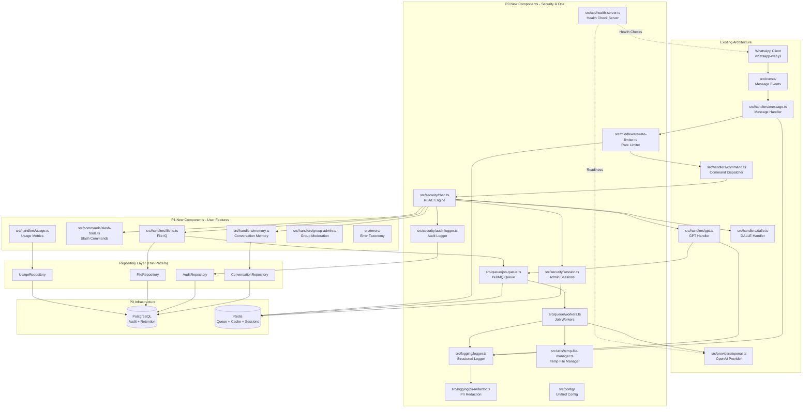

# Component Architecture

### New Components (P0-P1)

The following diagram shows how new components integrate with existing architecture:



### Component Responsibility Matrix

| Component | Responsibility | Dependencies | Integrates With |
|-----------|---------------|--------------|-----------------|
| **RBAC Engine** | Role-based access control, permission checks | Redis (sessions), AuditLogger | All command handlers |
| **Admin Sessions** | Short-lived admin session tokens (15min TTL) | Redis | RBAC Engine |
| **Audit Logger** | Immutable audit trail with hash chain | AuditRepository, Postgres | RBAC, Config, Broadcasts |
| **Structured Logger** | Pino-based logging with PII redaction | PII Redactor | All modules |
| **Rate Limiter** | Token bucket per user/global | Redis | Message Handler |
| **Job Queue** | BullMQ wrapper for heavy operations | Redis, Workers | GPT Handler, FileIQ, Transcription |
| **Job Workers** | Process queued jobs (FFmpeg, OCR, embeddings) | TempFileManager, OpenAI Provider | Job Queue |
| **Temp File Manager** | PID-scoped temp dirs, crash-safe cleanup | OS filesystem | Workers, Transcription |
| **Health Check Server** | HTTP server for /healthz, /readyz, /livez | WhatsApp Client, OpenAI Provider | Docker healthcheck |
| **Unified Config** | Immutable config from env, Zod validation | Zod schema | All modules |
| **Conversation Memory** | Per-chat context with TTL | ConversationRepository, Redis cache | GPT Handler |
| **Slash Tools** | Utility commands (/summarize, /translate, etc.) | whatsapp-web.js Buttons/Lists | Command Dispatcher |
| **File IQ** | OCR + embeddings + semantic search | FileRepository, Job Queue, OpenAI | Message Handler (media) |
| **Usage Metrics** | Track tokens, costs, API calls | UsageRepository, OpenAI Provider | All AI operations |
| **Group Moderation** | Rules, warnings, moderation | ModerationRepository | Message Handler (groups) |
| **Error Taxonomy** | User-friendly error messages | Error codes enum | All handlers (catch blocks) |

### Key Integration Patterns

#### 1. Repository Pattern (Thin)

**Purpose:** Encapsulate database operations without over-abstracting.

```typescript
// src/repositories/base-repository.ts
export abstract class BaseRepository {
  protected prisma = prisma;
}

// src/repositories/conversation-repository.ts
export class ConversationRepository extends BaseRepository {
  async save(chatId: string, messages: Message[], ttl: number) {
    return this.prisma.conversation_memory.upsert({
      where: { chat_id: chatId },
      update: {
        messages,
        expires_at: new Date(Date.now() + ttl * 24 * 60 * 60 * 1000),
        updated_at: new Date()
      },
      create: {
        chat_id: chatId,
        messages,
        expires_at: new Date(Date.now() + ttl * 24 * 60 * 60 * 1000)
      }
    });
  }

  async get(chatId: string): Promise<Message[] | null> {
    const memory = await this.prisma.conversation_memory.findUnique({
      where: { chat_id: chatId }
    });
    return memory?.messages as Message[] || null;
  }
}
```

#### 2. Middleware Pattern (Rate Limiting, Usage Tracking)

**Purpose:** Cross-cutting concerns applied to message handling pipeline.

```typescript
// src/middleware/rate-limiter.ts
export async function rateLimitMiddleware(message: Message, next: () => Promise<void>) {
  const userId = message.from;
  const allowed = await checkRateLimit(userId);  // Redis token bucket

  if (!allowed) {
    await message.reply("⏱️ Slow down! You're sending messages too quickly. Try again in 1 minute.");
    return;  // Short-circuit
  }

  await next();  // Continue to command dispatcher
}

// src/handlers/message.ts
export async function handleIncomingMessage(message: Message) {
  await rateLimitMiddleware(message, async () => {
    await commandDispatcher(message);
  });
}
```

#### 3. Job Queue Pattern (Heavy Operations)

**Purpose:** Offload blocking operations to background workers.

```typescript
// src/queue/job-queue.ts
export enum JobType {
  TRANSCRIPTION = 'transcription',
  VISION = 'vision',
  OCR = 'ocr',
  EMBEDDING = 'embedding',
  TTS = 'tts'
}

export async function enqueueJob(type: JobType, data: any, chatId: string) {
  const job = await queue.add(type, {
    ...data,
    chatId,
    timestamp: Date.now()
  }, {
    attempts: 3,
    backoff: { type: 'exponential', delay: 2000 }
  });

  return job.id;
}

// src/queue/workers.ts
queue.process(JobType.OCR, async (job) => {
  const { fileBuffer, chatId, fileId } = job.data;

  // 1. OCR extraction
  const text = await tesseract.recognize(fileBuffer);

  // 2. Generate embedding
  const embedding = await openai.embeddings.create({
    model: 'text-embedding-ada-002',
    input: text
  });

  // 3. Save to database
  await fileRepository.save(fileId, chatId, text, embedding.data[0].embedding);

  // 4. Notify user
  await whatsappClient.sendMessage(chatId, `✅ Your document "${fileName}" is ready! Use !askfile to search it.`);
});
```

#### 4. RBAC Integration Pattern

**Purpose:** Protect admin commands with role-based access control.

```typescript
// src/security/rbac.ts
export enum Role {
  OWNER = 'owner',
  ADMIN = 'admin',
  OPERATOR = 'operator',
  USER = 'user'
}

export function requireRole(minRole: Role) {
  return async (message: Message, next: () => Promise<void>) => {
    const userRole = await getUserRole(message.from);

    if (!hasPermission(userRole, minRole)) {
      await auditLogger.log(message.from, 'RBAC_DENIED', {
        command: message.body,
        required: minRole,
        actual: userRole
      });

      await message.reply("❌ Insufficient permissions. This command requires admin access.");
      return;
    }

    await auditLogger.log(message.from, 'RBAC_ALLOWED', {
      command: message.body,
      role: userRole
    });

    await next();
  };
}

// Usage in command handler
// src/commands/audit.ts
export async function handleAuditCommand(message: Message, args: string[]) {
  await requireRole(Role.OWNER)(message, async () => {
    const logs = await auditRepository.getLast(100);
    await message.reply(formatAuditLogs(logs));
  });
}
```

---

