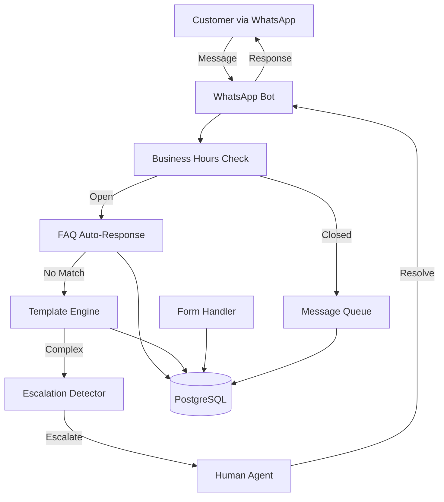

# Epic 2: Customer Service Essentials - Business Automation

**Priority:** P1 (Critical Business Value)
**Target Deployment:** Phase 1A (Sprint 3-4) and Phase 1B (Sprint 5-6)
**Dependencies:**
- **P0 #1-10** (Foundation - Sprint 1-2): RBAC, Logging, Database, Queue, Config
- **Epic 1** (Error Handling - Sprint 2-3): AppError, ErrorCode, USER_MESSAGES foundation
- **P1 #11** (Per-Chat Memory - Sprint 3): Conversation context for escalations
**Timeline:**
- **Can start:** Sprint 3 Week 1 (after Epic 1 completes)
- **Phase 1A:** Sprint 3-4 (Stories 1-4)
- **Phase 1B:** Sprint 5-6 (Story 5)
**Architecture Alignment:**
- Implements P1 #12 (Slash Tools - /template, /form commands)
- Implements P1 #16 (Group Admin Copilot - escalation system)
- Uses error handling from Epic 1 (AppError, ErrorCode, USER_MESSAGES)

## Epic Goal

Enable businesses to use the WhatsApp bot as a complete customer service automation platform, handling 70%+ of routine inquiries without human intervention while providing seamless escalation to human agents when needed.

---

## Business Context

### The Problem

Businesses using WhatsApp for customer service face:
- **High volume**: 100+ customer messages daily, agents overwhelmed
- **Repetitive questions**: 70% of inquiries are FAQs (shipping, hours, returns)
- **24/7 expectations**: Customers message outside business hours, expect instant responses
- **Language barriers**: Global customers speak different languages
- **No structure**: Collecting customer info (name, email, order number) is manual and error-prone
- **Cost**: Hiring enough agents for 24/7 coverage is expensive

### The Solution

Transform the bot into a customer service platform that:
1. **Automates routine inquiries** - FAQ auto-response, canned templates
2. **Collects structured data** - Forms for gathering customer information
3. **Handles off-hours** - Business hours auto-responder, message queuing
4. **Escalates intelligently** - Human agent handoff when needed
5. **Tracks performance** - CSAT surveys, conversation metrics

### Success Metrics

- ✅ **70% automation rate**: Bot handles 70% of inquiries without human intervention
- ✅ **<30s response time**: Instant responses for FAQs and common questions
- ✅ **90% CSAT**: Customer satisfaction score ≥4.0/5.0
- ✅ **3x cost savings**: Reduce agent headcount or extend coverage hours without hiring

---

## Epic Scope

### What's In Scope (P1 - Must Ship)

**Sprint 3-4 (Phase 1A - Customer Service Core):**
1. ✅ **Story 1: Response Templates & Canned Responses**
   - Pre-configured answers for common questions
   - Admin can add/edit/remove templates
   - Quick insertion via `/template <name>`

2. ✅ **Story 2: Quick Forms for Customer Data Collection**
   - Multi-step forms in WhatsApp (name, email, order number, issue type)
   - Structured data storage
   - Form validation and retry on errors

3. ✅ **Story 3: FAQ Auto-Response System**
   - Upload FAQ database (Q&A pairs)
   - Semantic search using embeddings
   - Auto-detect and respond to FAQ matches
   - "Was this helpful?" feedback loop

4. ✅ **Story 4: Business Hours & Auto-Responder**
   - Configure business hours per timezone
   - Auto-response when closed
   - Message queue for off-hours inquiries
   - Notify agents when business opens

**Sprint 5-6 (Phase 1B - Human-AI Collaboration):**
5. ✅ **Story 5: Human Escalation & Agent Handoff**
   - Detect escalation triggers (keywords, sentiment, explicit request)
   - Transfer conversation to human agent
   - Agent interface (web dashboard or WhatsApp group)
   - Conversation handback to bot after resolution

### What's Out of Scope (Future Phases)

❌ **CSAT Surveys** - Phase 2 (P1 Sprint 7-8)
❌ **Multi-Language Translation** - Phase 2 (P1 Sprint 7-8)
❌ **Workflow Automation** - Phase 2 (P1 Sprint 7-8)
❌ **Analytics Dashboard** - Phase 3 (P2)
❌ **CRM Integration** - Phase 3 (P2)

---

## Stories in This Epic

| Story | Title | Effort | Priority | Dependencies |
|-------|-------|--------|----------|--------------|
| **1** | Response Templates & Canned Responses | 3-5 hours | P1 Critical | P0 #10 (Unified Config) |
| **2** | Quick Forms for Customer Data Collection | 5-8 hours | P1 Critical | P0 #3 (Database), Story 1 |
| **3** | FAQ Auto-Response System | 8-13 hours | P1 Critical | P0 #3 (Database), P1 #11 (Memory) |
| **4** | Business Hours & Auto-Responder | 3-5 hours | P1 High | P0 #10 (Config) |
| **5** | Human Escalation & Agent Handoff | 8-13 hours | P1 Critical | P0 #6 (Queue), Stories 1-4 |

**Total Estimated Effort:** 27-44 hours (~1-2 sprints for 2-person team)

---

## Technical Architecture

### System Components



### Data Models (Prisma Schema)

**Note:** All tables use Prisma ORM with thin repository pattern (per Architecture). SQL shown for reference, actual implementation uses Prisma models in `prisma/schema.prisma`.

**Templates Table:**
```sql
CREATE TABLE templates (
  id SERIAL PRIMARY KEY,
  name VARCHAR(100) UNIQUE NOT NULL,
  content TEXT NOT NULL,
  category VARCHAR(50),
  usage_count INTEGER DEFAULT 0,
  created_by VARCHAR(255),
  created_at TIMESTAMP DEFAULT NOW(),
  updated_at TIMESTAMP DEFAULT NOW()
);
```

**FAQ Table:**
```sql
CREATE TABLE faqs (
  id SERIAL PRIMARY KEY,
  question TEXT NOT NULL,
  answer TEXT NOT NULL,
  category VARCHAR(50),
  keywords TEXT[],
  embedding vector(1536),  -- OpenAI ada-002 embedding
  usage_count INTEGER DEFAULT 0,
  helpful_count INTEGER DEFAULT 0,
  not_helpful_count INTEGER DEFAULT 0,
  created_at TIMESTAMP DEFAULT NOW()
);
```

**Forms Table:**
```sql
CREATE TABLE form_submissions (
  id SERIAL PRIMARY KEY,
  chat_id VARCHAR(255) NOT NULL,
  form_type VARCHAR(50) NOT NULL,
  data JSONB NOT NULL,
  submitted_at TIMESTAMP DEFAULT NOW()
);
```

**Business Hours Config:**
```sql
CREATE TABLE business_hours (
  id SERIAL PRIMARY KEY,
  day_of_week INTEGER NOT NULL,  -- 0=Sunday, 6=Saturday
  open_time TIME NOT NULL,
  close_time TIME NOT NULL,
  timezone VARCHAR(50) DEFAULT 'UTC',
  is_active BOOLEAN DEFAULT true
);
```

**Escalations Table:**
```sql
CREATE TABLE escalations (
  id SERIAL PRIMARY KEY,
  chat_id VARCHAR(255) NOT NULL,
  customer_phone VARCHAR(50) NOT NULL,
  reason VARCHAR(100),
  status VARCHAR(20) DEFAULT 'pending',  -- pending, assigned, resolved
  assigned_agent VARCHAR(255),
  context JSONB,  -- Conversation history
  created_at TIMESTAMP DEFAULT NOW(),
  resolved_at TIMESTAMP
);
```

---

### Error Handling Standards (Epic 1 Integration)

**Epic 2 uses the error handling foundation from Epic 1**: `AppError`, `ErrorCode` enum, `USER_MESSAGES` catalog.

**Epic 2 Error Codes** (added to `src/errors/error-codes.ts`):

```typescript
export enum ErrorCode {
  // ... existing codes from Epic 1 ...

  // Template errors (Story 1)
  TEMPLATE_NOT_FOUND = 'TEMPLATE_NOT_FOUND',             // Template doesn't exist
  TEMPLATE_DUPLICATE = 'TEMPLATE_DUPLICATE',             // Template name already exists
  TEMPLATE_INVALID_NAME = 'TEMPLATE_INVALID_NAME',       // Invalid characters in name
  TEMPLATE_CONTENT_TOO_LONG = 'TEMPLATE_CONTENT_TOO_LONG', // Content exceeds 2000 chars

  // Form errors (Story 2)
  FORM_VALIDATION_ERROR = 'FORM_VALIDATION_ERROR',       // Invalid input format
  FORM_TIMEOUT = 'FORM_TIMEOUT',                         // User didn't respond in time
  FORM_CANCELLED = 'FORM_CANCELLED',                     // User cancelled form
  FORM_STORAGE_ERROR = 'FORM_STORAGE_ERROR',             // Database save failed

  // FAQ errors (Story 3)
  FAQ_SEARCH_ERROR = 'FAQ_SEARCH_ERROR',                 // Embedding/search failed
  FAQ_NO_MATCH = 'FAQ_NO_MATCH',                         // No FAQ matched query
  FAQ_UPLOAD_ERROR = 'FAQ_UPLOAD_ERROR',                 // CSV upload failed
  FAQ_EMBEDDING_ERROR = 'FAQ_EMBEDDING_ERROR',           // OpenAI embedding generation failed

  // Business hours errors (Story 4)
  BUSINESS_HOURS_CONFIG_ERROR = 'BUSINESS_HOURS_CONFIG_ERROR', // Invalid config
  BUSINESS_HOURS_QUEUE_ERROR = 'BUSINESS_HOURS_QUEUE_ERROR',   // Failed to queue message

  // Escalation errors (Story 5)
  ESCALATION_NO_AGENT = 'ESCALATION_NO_AGENT',           // No agents available
  ESCALATION_CREATION_ERROR = 'ESCALATION_CREATION_ERROR', // Failed to create escalation
  ESCALATION_HANDOFF_ERROR = 'ESCALATION_HANDOFF_ERROR', // Agent handoff failed
}
```

**Epic 2 User Messages** (added to `src/errors/user-messages.ts`):

```typescript
export const USER_MESSAGES = {
  // ... existing messages from Epic 1 ...

  // Template error messages
  [ErrorCode.TEMPLATE_NOT_FOUND]:
    "Template not found. Use /template list to see available templates.",
  [ErrorCode.TEMPLATE_DUPLICATE]:
    "A template with that name already exists. Use /template edit to update it.",
  [ErrorCode.TEMPLATE_INVALID_NAME]:
    "Template name must be alphanumeric (a-z, 0-9, _, -). Example: shipping_policy",
  [ErrorCode.TEMPLATE_CONTENT_TOO_LONG]:
    "Template content is too long (max 2000 characters). Please shorten it.",

  // Form error messages
  [ErrorCode.FORM_VALIDATION_ERROR]:
    "Invalid format. Please try again with the correct format.",
  [ErrorCode.FORM_TIMEOUT]:
    "Form timed out due to inactivity. Type /form restart to begin again.",
  [ErrorCode.FORM_CANCELLED]:
    "Form cancelled. Type /form to start a new form.",
  [ErrorCode.FORM_STORAGE_ERROR]:
    "Failed to save form data. Please try again or contact support.",

  // FAQ error messages
  [ErrorCode.FAQ_SEARCH_ERROR]:
    "Error searching FAQs. Please try rephrasing your question.",
  [ErrorCode.FAQ_NO_MATCH]:
    "I couldn't find an answer to that question. Let me connect you with a team member.",
  [ErrorCode.FAQ_UPLOAD_ERROR]:
    "Failed to upload FAQ database. Please check the file format (CSV with question,answer columns).",
  [ErrorCode.FAQ_EMBEDDING_ERROR]:
    "Error processing FAQ. This has been logged and our team will investigate.",

  // Business hours error messages
  [ErrorCode.BUSINESS_HOURS_CONFIG_ERROR]:
    "Business hours configuration error. Please contact system administrator.",
  [ErrorCode.BUSINESS_HOURS_QUEUE_ERROR]:
    "Failed to queue your message. Please try again or call us directly.",

  // Escalation error messages
  [ErrorCode.ESCALATION_NO_AGENT]:
    "All agents are currently busy. We'll respond within 1 hour. Thank you for your patience!",
  [ErrorCode.ESCALATION_CREATION_ERROR]:
    "Error creating escalation. Please contact support directly at support@example.com",
  [ErrorCode.ESCALATION_HANDOFF_ERROR]:
    "Error transferring to agent. Please try again or contact support directly.",
};
```

**Error Handling Pattern (All Stories):**

```typescript
// Example from Story 1 - Templates
try {
  const template = await templateRepository.findByName(name);
  if (!template) {
    throw new AppError(
      ErrorCode.TEMPLATE_NOT_FOUND,
      USER_MESSAGES[ErrorCode.TEMPLATE_NOT_FOUND],
      { templateName: name }
    );
  }
  // ... use template
} catch (error) {
  if (error instanceof AppError) {
    logger.error({ errorCode: error.code, details: error.details }, error.userMessage);
    await message.reply(error.userMessage);
  } else {
    logger.error({ error }, 'Unexpected error in template handler');
    await message.reply('An unexpected error occurred. Please try again.');
  }
}
```

---

### Logging Strategy (Pino from P0 #2)

**Epic 2 uses Pino structured logger from P0 #2** (same as Epic 1) for all operations.

**What Gets Logged:**

**Story 1 - Templates:**
```typescript
logger.info({ name, createdBy: userPhone }, 'Template created');
logger.info({ templateName: name, usedBy: userPhone }, 'Template used');
logger.error({ errorCode, templateName }, 'Template operation failed');
```

**Story 2 - Forms:**
```typescript
logger.info({ formType, chatId, fieldsCollected }, 'Form initiated');
logger.warn({ formType, chatId, field, invalidInput }, 'Form validation failed');
logger.info({ formType, chatId, submissionId }, 'Form submitted');
logger.error({ errorCode, formType }, 'Form operation failed');
```

**Story 3 - FAQ:**
```typescript
logger.info({ query, matchConfidence, faqId, searchTime }, 'FAQ match found');
logger.warn({ query, searchTime }, 'No FAQ match found');
logger.info({ faqId, helpful }, 'FAQ feedback received');
logger.error({ errorCode, query }, 'FAQ search failed');
```

**Story 4 - Business Hours:**
```typescript
logger.debug({ isOpen, timezone, currentTime }, 'Business hours check');
logger.info({ chatId, queuedMessageId }, 'Message queued (off-hours)');
logger.info({ queueSize }, 'Processing queued messages (business opened)');
logger.error({ errorCode, timezone }, 'Business hours operation failed');
```

**Story 5 - Escalation:**
```typescript
logger.info({ chatId, reason, trigger }, 'Escalation triggered');
logger.info({ escalationId, agentPhone }, 'Escalation assigned to agent');
logger.info({ escalationId, resolutionTime }, 'Escalation resolved');
logger.error({ errorCode, chatId }, 'Escalation operation failed');
```

**Performance Metrics Logged:**
- Template lookup time
- Form validation time
- FAQ search time (important - should be <500ms)
- Escalation creation time
- Business hours check time

**PII Redaction:**
- Automatic via P0 #2 PII redactor
- Customer phone numbers redacted
- Email addresses redacted
- No manual redaction needed

---

## Integration Points

### Existing System Integration

**Uses from P0/P1:**
- ✅ **P0 #3 (Database)** - PostgreSQL for templates, FAQs, forms, escalations
- ✅ **P0 #6 (Queue)** - BullMQ for off-hours message queue
- ✅ **P0 #10 (Config)** - Unified config for business hours, templates
- ✅ **P1 #11 (Memory)** - Conversation context for escalation handoff
- ✅ **Epic 1** - Error handling for reliable customer interactions

**Extends:**
- `src/handlers/message.ts` - Add business hours check, FAQ lookup, form handling
- `src/handlers/command.ts` - Add `/template`, `/form`, `/escalate` commands
- `src/config/schema.ts` - Add business hours, FAQ settings

**New Modules:**
- `src/handlers/templates.ts` - Template CRUD and insertion
- `src/handlers/faq.ts` - FAQ matching and auto-response
- `src/handlers/forms.ts` - Form collection and validation
- `src/handlers/business-hours.ts` - Hours check and auto-responder
- `src/handlers/escalation.ts` - Escalation detection and agent handoff
- `src/repositories/template-repository.ts`
- `src/repositories/faq-repository.ts`
- `src/repositories/form-repository.ts`
- `src/repositories/escalation-repository.ts`

---

## User Experience Flows

### Flow 1: FAQ Auto-Response (Happy Path)

```
Customer: "What are your shipping costs?"

Bot: [Searches FAQ database]
Bot: "📦 Shipping is $5 for orders under $50, FREE for orders over $50!

     Was this helpful?
     [👍 Yes] [👎 No, I need more help]"

Customer: [Clicks 👍 Yes]

Bot: "Great! Is there anything else I can help with?"
```

### Flow 2: Form Collection

```
Bot: "I'll help you track your order! Let me collect some information.

     What's your order number? (e.g., ORD-12345)"

Customer: "ORD-98765"

Bot: "✅ Order number: ORD-98765

     What's the email address on the order?"

Customer: "jane@example.com"

Bot: "✅ Email: jane@example.com

     Perfect! Looking up your order...

     Your order shipped on Jan 15 and should arrive by Jan 20.
     Tracking: track.example.com/ORD-98765"
```

### Flow 3: Business Hours Auto-Response

```
[Customer messages at 11 PM - outside business hours]

Customer: "I need help with my order!"

Bot: "👋 Thanks for contacting Acme Support!

     We're currently closed. Our business hours:
     Monday-Friday: 9 AM - 6 PM PST
     Saturday-Sunday: Closed

     Your message has been queued and our team will respond when we open
     at 9 AM PST (in ~10 hours).

     For urgent issues, call: +1-555-123-4567"
```

### Flow 4: Human Escalation

```
Customer: "This is ridiculous! I want a refund NOW!"

Bot: [Detects frustrated tone + refund request]
Bot: "I understand this is frustrating. Let me connect you with a team
     member who can help resolve this.

     Transferring to Sarah (Support Agent)..."

[Escalation created in system, agent Sarah notified]

Sarah (Agent): "Hi! I'm Sarah from the support team. I've reviewed your
                conversation. I apologize for the inconvenience. Let me
                help you with that refund..."
```

---

## Testing Strategy

### Acceptance Testing

**Story 1 - Templates:**
- ✅ Admin can add template via `/template add shipping "Shipping is $5 under $50..."`
- ✅ Agent can list templates via `/template list`
- ✅ Agent can use template via `/template shipping` (inserts content)
- ✅ Template usage tracked in database

**Story 2 - Forms:**
- ✅ Bot initiates form collection when triggered
- ✅ Form validates input (email format, order number format)
- ✅ Form retries on invalid input with helpful message
- ✅ Form data stored in database in JSONB format
- ✅ Form submission tracked per chat

**Story 3 - FAQ:**
- ✅ Admin uploads FAQ CSV with questions and answers
- ✅ Bot detects FAQ match with 85%+ similarity
- ✅ Bot responds with FAQ answer
- ✅ Bot asks "Was this helpful?" with buttons
- ✅ Feedback tracked (helpful vs not helpful count)

**Story 4 - Business Hours:**
- ✅ Bot responds instantly during business hours
- ✅ Bot sends auto-response outside business hours
- ✅ Messages queued when closed
- ✅ Queued messages processed when business opens
- ✅ Agent notified of queued messages at opening time

**Story 5 - Escalation:**
- ✅ Bot detects escalation triggers (keywords: "refund", "manager", "urgent")
- ✅ Bot detects frustrated tone via sentiment analysis
- ✅ Bot transfers conversation to available agent
- ✅ Agent sees conversation history and context
- ✅ Agent can mark escalation as resolved
- ✅ Bot resumes normal operation after resolution

### Performance Requirements

| Metric | Target | Story |
|--------|--------|-------|
| Template insertion | <100ms | 1 |
| Form validation | <200ms | 2 |
| FAQ search (1000 FAQs) | <500ms | 3 |
| Business hours check | <50ms | 4 |
| Escalation detection | <1s | 5 |
| Agent notification | <5s | 5 |

---

## Risks & Mitigation

### Risk 1: FAQ accuracy (false positives/negatives)

**Risk:** Bot responds with wrong FAQ or misses obvious FAQ

**Mitigation:**
- Use 85% similarity threshold (tunable via config)
- Include "Was this helpful?" feedback loop
- Admin dashboard to review mismatches
- Fallback: If confidence <85%, show "Did you mean?" with options

### Risk 2: Business hours timezone confusion

**Risk:** Wrong timezone causes customers to get auto-response during business hours

**Mitigation:**
- Store timezone in config, validate on startup
- Display timezone in auto-response message
- Test across multiple timezones before deployment
- Log all business hours checks for debugging

### Risk 3: Agent handoff delays

**Risk:** Escalation created but no agent available to respond

**Mitigation:**
- Configure escalation SLA (e.g., "Agent will respond within 15 minutes")
- Alert agents via SMS/email when escalation created
- Fallback: If no agent responds in 15 min, send "All agents busy, we'll respond within 1 hour"
- Track escalation wait time in metrics

### Risk 4: Form abandonment

**Risk:** Customer starts form, doesn't complete it

**Mitigation:**
- Timeout: Cancel form after 5 minutes of inactivity
- Allow restart: "Type /form restart to begin again"
- Save partial submissions for analytics
- Limit forms to 3-5 fields maximum

---

## Rollout Plan

### Phase 1A (Sprint 3-4): Core Automation

**Week 1:**
- ✅ Story 1: Templates (Day 1-2)
- ✅ Story 2: Forms (Day 3-5)

**Week 2:**
- ✅ Story 3: FAQ Auto-Response (Day 1-5)
- ✅ Story 4: Business Hours (Day 1-2, parallel with Story 3)

**Deployment:** Beta test with 1 business, 10 customers

---

### Phase 1B (Sprint 5-6): Human Collaboration

**Week 3:**
- ✅ Story 5: Human Escalation (Day 1-5)

**Week 4:**
- Integration testing
- Load testing (100 concurrent customers)
- Agent training and onboarding

**Deployment:** Production release to 5 businesses

---

## Definition of Done (Epic Level)

- ✅ All 5 stories completed and tested
- ✅ **Unit tests pass (>80% coverage for all new code per Architecture standards)**
- ✅ **Integration tests pass for all stories**
- ✅ **Error handling using AppError from Epic 1 (all error scenarios covered)**
- ✅ **Pino logging implemented for all operations (consistent with Epic 1)**
- ✅ Bot can handle 70% of inquiries without human intervention (measured over 1 week)
- ✅ Average response time <30 seconds for FAQs
- ✅ Escalation system tested with real agents
- ✅ Business hours tested across 3 timezones
- ✅ Forms collect data with <10% abandonment rate
- ✅ Documentation updated (admin guide, agent training)
- ✅ CLAUDE.md updated with customer service patterns
- ✅ Load tested: 100 concurrent customers, 1000 messages/hour
- ✅ Production deployment to 5 pilot businesses
- ✅ CSAT ≥4.0/5.0 from pilot businesses

---

## Next Steps After Epic 2

**Phase 2 (Sprint 7-8): Advanced Automation**
- CSAT Surveys
- Multi-Language Translation
- Workflow Automation
- Broadcast Messages

**Phase 3 (Future): Analytics & Integration**
- Analytics Dashboard
- CRM Integration (Salesforce, HubSpot)
- SLA Tracking & Alerts
- Advanced Reporting

---

## Appendix: Real-World Business Examples

### Example 1: E-Commerce Store

**Business:** Small online clothing store (50 orders/day, 200 WhatsApp messages/day)

**Before Epic 2:**
- 2 agents manually respond to every message
- 70% are FAQs (shipping, returns, sizing)
- Agent cost: $3000/month
- Response time: 5-30 minutes

**After Epic 2:**
- Bot handles 70% of FAQs automatically (<30s response)
- Forms collect order info for tracking requests
- After-hours auto-responder queues messages
- Complex issues escalate to 1 agent
- Agent cost: $1500/month (50% reduction)
- Response time: <1 minute for FAQs, 5-10 min for escalations

**ROI:** $1500/month savings, 10x faster FAQ responses

---

### Example 2: Service Business (Plumbing/HVAC)

**Business:** Local plumbing service (20 appointments/day, 100 WhatsApp messages/day)

**Before Epic 2:**
- Receptionist manually books appointments
- After-hours calls go to voicemail (lost business)
- No structured customer data collection

**After Epic 2:**
- Bot collects customer info via forms (name, address, issue)
- FAQ auto-response for pricing, hours, service areas
- After-hours auto-responder with emergency escalation
- Urgent keywords ("flood", "leak", "burst pipe") trigger immediate alert
- Form data pre-fills appointment booking system

**ROI:** 24/7 availability, 30% more bookings from after-hours leads

---

### Example 3: SaaS Support Team

**Business:** Software company (100 support tickets/day via WhatsApp)

**Before Epic 2:**
- 5 support agents handle all inquiries
- 60% are "How do I..." questions covered in docs
- No triage, all messages go to general queue

**After Epic 2:**
- Bot answers 60% of "How do I..." with FAQ auto-response
- Forms collect account info, error details for bug reports
- Escalation system routes complex issues to L2 agents
- Templates for common troubleshooting steps
- 3 agents handle escalations only (40% reduction)

**ROI:** $6000/month savings, agents focus on complex issues
